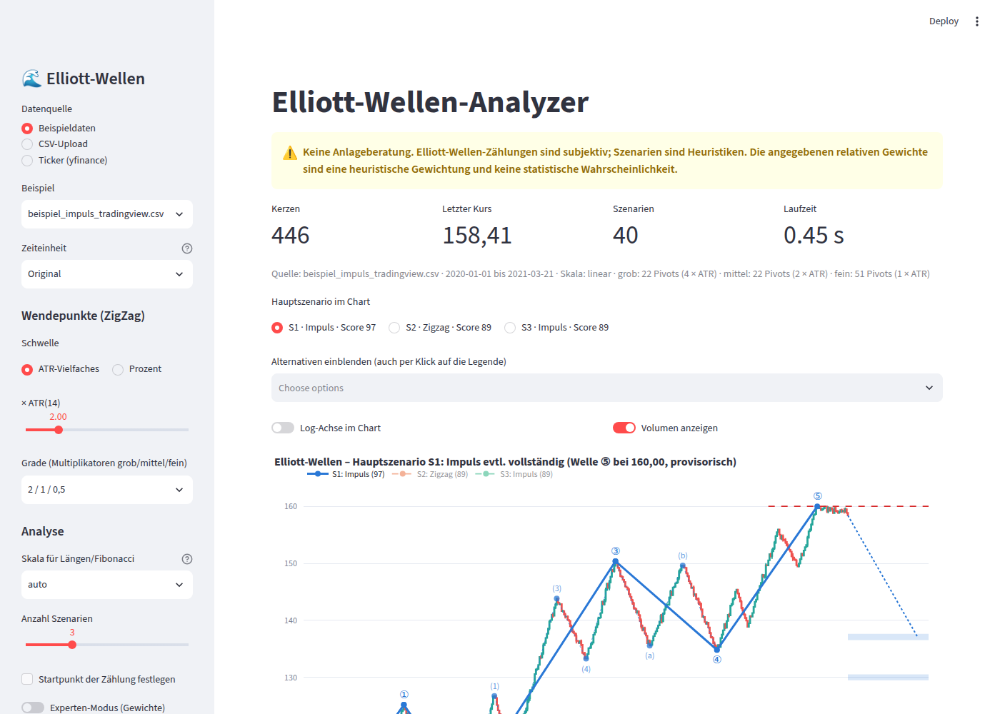
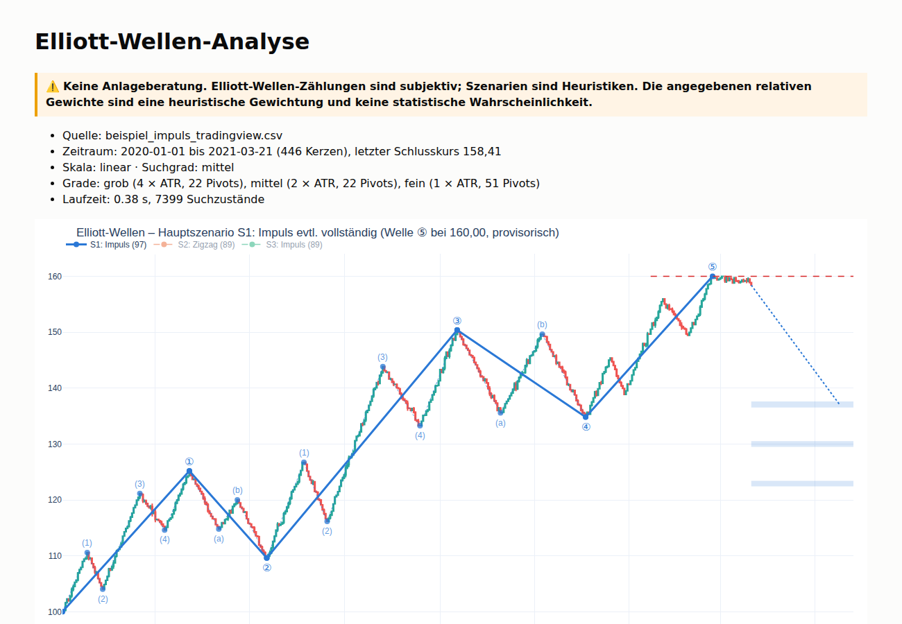

# Elliott-Wellen-Analyzer

> ⚠️ **Keine Anlageberatung. Elliott-Wellen-Zählungen sind subjektiv; Szenarien sind Heuristiken.**
> Die ausgegebenen „relativen Gewichtungen“ sind eine heuristische Softmax-Gewichtung der Scores –
> keine statistische Wahrscheinlichkeit.

Das Programm erkennt aus historischen Kursdaten (OHLC) automatisch **alle regelkonformen
Elliott-Wellen-Zählungen** nach Frost & Prechter, bewertet sie transparent und stellt die
besten Szenarien mit **Kurszielen**, **Invalidierungs-Levels** und **Alternativszenario** dar.
Es liefert bewusst nicht „die eine richtige“ Zählung, sondern begründet für jedes Szenario,
warum es besser oder schlechter bewertet ist als ein anderes.



## Inhalt

- [Installation](#installation)
- [Schnellstart](#schnellstart)
- [Datenformate](#datenformate)
- [Wie funktioniert die Analyse?](#wie-funktioniert-die-analyse)
- [Ausgabe](#ausgabe)
- [Konfiguration](#konfiguration)
- [Projektstruktur](#projektstruktur)
- [Tests & Benchmark](#tests--benchmark)
- [Designentscheidungen & Grenzen](#designentscheidungen--grenzen)

## Installation

Voraussetzung: Python 3.11+

```bash
git clone <repo-url> elliott-wellen
cd elliott-wellen
python -m venv .venv && source .venv/bin/activate   # Windows: .venv\Scripts\activate
pip install -e .            # App + CLI
pip install -e ".[dev]"     # zusätzlich pytest
```

## Schnellstart

**Web-Oberfläche** (Upload, Parameter, Szenario-Auswahl, Downloads):

```bash
streamlit run app/streamlit_app.py
```

Die App startet mit Beispieldaten aus `examples/`; alternativ CSV hochladen oder einen
Ticker über yfinance laden.

**Kommandozeile:**

```bash
elliott analyze examples/beispiel_impuls_tradingview.csv --threshold atr:2 --log auto --top 3 --out report/
elliott analyze --ticker BTC-USD --interval 1d --period 2y
elliott analyze examples/beispiel_zigzag_deutsch.csv --resample 1wk --start 2020-06-01
```

| Option | Bedeutung |
|---|---|
| `--threshold` | ZigZag-Schwelle des Suchgrades: `atr:2` (2 × ATR 14), `pct:5` oder `5%` |
| `--log` | `auto` (log, wenn Hoch/Tief > 3), `linear`, `log` |
| `--top` | Anzahl Szenarien (erhalten eine relative Gewichtung) |
| `--start` | Startdatum der Zählung (nächster Pivot wird verwendet) |
| `--resample` | höhere Zeiteinheit, z. B. `1wk`, `1mo`, `4h` |
| `--config` | eigene YAML-Konfiguration (nur abweichende Werte) |
| `--out` | Verzeichnis für `analysis.json`, `report.md`, `report.html` |
| `--cdn` | Plotly im HTML-Report per CDN laden statt einbetten (kleinere Datei) |

**Als Bibliothek:**

```python
from elliott.data.loader import load_data
from elliott.pipeline import analyze
from elliott.settings import load_settings

cfg = load_settings()
result = analyze(load_data("examples/beispiel_impuls_tradingview.csv", cfg.data), cfg)
best = result.scenarios[0]
print(best.projection.position, best.projection.invalidation.reason)
```

## Datenformate

CSV mit den Spalten `Date, Open, High, Low, Close` (`Volume` optional). Automatisch erkannt werden:

- **TradingView-Export** (`time` als Unix-Zeitstempel oder ISO-Datum mit Zeitzone),
- **Yahoo Finance** (`Adj Close` wird ignoriert, `Close` bevorzugt),
- **deutsche Exporte** (`Datum;Eröffnung;Hoch;Tief;Schlusskurs;Volumen`, Semikolon, Dezimalkomma,
  Tausenderpunkt, `31.12.2023`),
- verschiedene Datumsformate, Unix-Sekunden/-Millisekunden, unbenannte Index-Spalten.

Validierung: Sortierung, Duplikate, fehlende Werte (ergänzt, mit Hinweis), `High ≥ max(Open, Close)`
und `Low ≤ min(Open, Close)` (kleine Abweichungen werden korrigiert, große führen zu einer
verständlichen Fehlermeldung), Preise > 0, Mindestanzahl Kerzen, Lückenwarnung.

**Screenshots/Bilder werden nicht unterstützt:** Aus Chartbildern lassen sich Kurse nur grob
rekonstruieren – für Fibonacci-Verhältnisse und exakte Invalidierungs-Levels ist das zu ungenau.

## Wie funktioniert die Analyse?

1. **Pivots (ZigZag)** auf High/Low, Schwelle in Prozent oder als ATR-Vielfaches. Jede Kerze wird
   in zwei „Ticks“ (Hoch/Tief) zerlegt, deren Reihenfolge aus dem Kerzenkörper geschätzt wird –
   so werden Outside Bars sauber behandelt. Mehrere Grade (grob/mittel/fein) werden verschachtelt
   berechnet: jeder grobe Pivot ist auch ein feiner Pivot. Der letzte Pivot am rechten Rand ist
   **provisorisch**.
2. **Suche (Beam Search)** über die Pivots des Suchgrades: Wellen werden einzeln angehängt, jede
   **harte Regel** wird sofort geprüft (frühes Pruning). Pivots dürfen übersprungen werden
   (sie gehören dann zu Subwellen). Jede Zählung endet am rechten Rand – dadurch werden auch
   **unvollständige Muster** erkannt („Welle 3 von 5 läuft“, „Welle B läuft“), einschließlich
   laufender Wellen mit internem Rücksetzer.
3. **Subwellen-Validierung**: Für jede Welle wird rekursiv auf feineren Graden geprüft, ob eine
   erlaubte Binnenstruktur existiert (z. B. 5 Wellen für Welle 3, keine Dreiecke als Welle 2).
   Fehlen feinere Pivots, wird die Welle als „nicht validiert“ markiert.
4. **Scoring** (0–100) aus gewichteten Richtlinien mit kontinuierlichen Fibonacci-Toleranzbändern,
   Strafpunkten für seltene Muster (Truncation, Running Flat, expandierende Dreiecke) und einem
   Occam-Abzug für komplexe Muster. Softmax über die Top-N liefert die relative Gewichtung.
5. **Projektion**: aktuelle Position (inkl. Subzählung der laufenden Welle), Kursziel-Zonen
   (Konfluenz hervorgehoben), **Invalidierungs-Level per Bisektion über die harten Regeln**
   (exakter Preis + verletzte Regel), strukturelle Level, Alternativszenario und eine
   (unsichere) Fib-Zeitprojektion.

### Unterstützte Muster und harte Regeln

| Muster | Harte Regeln (Auswahl) |
|---|---|
| Impuls 5-3-5-3-5 | W2 < 100 % von W1 · W3 über Ende W1 · W3 nie die kürzeste · W4 ohne Überlappung mit W1 |
| Leading/Ending Diagonal | W4 überlappt W1 · kontrahierend (W3<W1, W5<W3, W4<W2) oder expandierend · Trendlinien konvergieren/divergieren · Leading nur als 1/A, Ending nur als 5/C |
| Zigzag 5-3-5, Double/Triple | B nicht über A-Start · C über A-Ende |
| Flat 3-3-5 | B ≥ ~90 % von A · Regular (B ≈ 100 %), Expanded (B > 100 %, C über A-Ende), Running (C erreicht A-Ende nicht) |
| Dreieck 3-3-3-3-3 | contracting / barrier / expanding · Linien A–C und B–D · nie als Welle 2 |
| Kombination W-X-Y(-X-Z) | max. ein Dreieck, nur am Ende · seitwärts |

Die Truncation (verkürzte Welle 5) ist erlaubt, wird aber deutlich bestraft und im Report
ausgewiesen. Jede Regel ist eine eigene, getestete Funktion in `src/elliott/rules.py` und
liefert `(bestanden, begründung)`.

## Ausgabe



- **Chart (Plotly)**: Candles (optional Volumen), Log-Achse umschaltbar, Wellenlabels nach
  Grad-Konvention (① ② ③ / (1) (2) (3) / 1 2 3 / i ii iii und Ⓐ Ⓑ Ⓒ / (a) (b) (c) / a b c),
  Subwellen gepunktet, Zielzonen halbtransparent, Invalidierung rot gestrichelt, projizierte
  nächste Welle als gestrichelter Pfad. Alternativen per Legende/Toggle zuschaltbar.
- **Report** (Markdown/HTML): Tabelle aller Szenarien (Rang, Muster, Position, Score, relative
  Gewichtung, Ziele, Invalidierung) und je Szenario alle Wellen mit Start/Ende, Länge,
  Verhältnissen, Binnenstruktur, Score-Aufschlüsselung und Regelprüfung.
- **JSON**: das komplette `AnalysisResult` (maschinenlesbar, per `report.load_json` wieder einlesbar).

## Konfiguration

Alle Schwellwerte, Toleranzen, Fibonacci-Verhältnisse und Gewichte stehen in
[`src/elliott/config/default.yaml`](src/elliott/config/default.yaml) – im Code gibt es keine
Magic Numbers (die Pydantic-Modelle in `settings.py` haben bewusst keine Defaults; ein Test prüft das).
Eigene Konfigurationen enthalten nur die abweichenden Werte:

```yaml
# meine.yaml
pivots:
  threshold: {mode: percent, value: 4}
search:
  beam_width: 500
guidelines:
  weights:
    impulse_channel: 1.0
fib:
  tolerance: 0.05
```

```bash
elliott analyze daten.csv --config meine.yaml
```

Wichtige Abschnitte: `pivots` (Schwelle, Grad-Multiplikatoren), `search` (Suchgrad, Überspringen,
Beam-Breite, Zeitbudget, Deduplizierung, Subwellen-Tiefe), `rules` (Toleranzen der harten Regeln),
`fib` (Toleranzband ±3 % und Abfall), `guidelines` (Gewichte, Zielverhältnisse, Strafpunkte,
Komplexität), `scoring` (Softmax-Temperatur, Top-N), `projection` (Zielverhältnisse, Zonen,
Konfluenz), `plotting` (Farben, Label-Stile).

## Projektstruktur

```
├── pyproject.toml
├── app/streamlit_app.py          # Web-Oberfläche
├── examples/                     # Beispiel-CSVs (TradingView, deutsches Format) + Generator
├── docs/                         # Screenshots
├── src/elliott/
│   ├── config/default.yaml       # alle Schwellwerte & Gewichte
│   ├── settings.py               # Pydantic-Konfiguration, YAML-Merge
│   ├── models.py                 # Pivot, Wave, WaveCount, Scenario, Projection …
│   ├── data/loader.py            # CSV/yfinance, Validierung, Resampling, Log-Wahl
│   ├── data/indicators.py        # ATR, RSI
│   ├── pivots/zigzag.py          # ZigZag, Grad-Hierarchie
│   ├── measure.py                # linear/log-Maß, normalisierte CountView
│   ├── fibonacci.py              # Retracements, Extensions, Toleranzbänder
│   ├── rules.py                  # harte Regeln (je Funktion)
│   ├── guidelines.py             # weiche Richtlinien
│   ├── patterns/                 # Impuls, Diagonal, Zigzag, Flat, Dreieck, Kombination
│   ├── search.py                 # Beam Search, Subwellen-Validierung, Deduplizierung
│   ├── scoring.py                # Score, Strafpunkte, Softmax
│   ├── projection.py             # Position, Ziele, Invalidierung, Alternativen
│   ├── pipeline.py               # analyze() – einziger Einstieg des Kerns
│   ├── report.py                 # JSON / Markdown / HTML
│   ├── plotting.py               # Plotly (reine Darstellung)
│   └── cli.py                    # Typer-CLI
└── tests/                        # inkl. synthetic.py (Generator für Lehrbuch-Muster)
```

Die Kernlogik (`pipeline`, `search`, `projection`, `report` …) importiert weder Streamlit noch
Plotly – ein Test stellt das sicher.

## Tests & Benchmark

```bash
pytest                      # alle Tests
pytest -m benchmark -s      # nur Performance-Test mit Zeitausgabe
```

- Positiv-/Negativtest für jede harte Regel, Fibonacci linear und log.
- Synthetischer Generator (`tests/synthetic.py`) für Lehrbuch-Impuls, extended W3, Truncation,
  Zigzag, Regular/Expanded Flat, Contracting Triangle, Ending Diagonal – mit einstellbarem Rauschen.
- Integration: Lehrbuch-Impuls auf Rang 1, mit moderatem Rauschen in den Top 3; alle anderen
  Muster in den Top 3; unvollständige Impulse (Welle 3/4/5 läuft) werden erkannt.
- Invariante: **jede ausgegebene Zählung wird erneut gegen `rules.py` geprüft** (auch Subzählungen,
  auch für Seitwärtsmärkte und Zufallsdaten).
- Edge Cases: sehr wenige Kerzen, Seitwärtsmarkt, extreme Spikes, fehlendes Volumen, flache Daten.
- Benchmark: 2.000 Kerzen mit ~40–60 Pivots auf dem Suchgrad in ca. 1–2 s (Vorgabe < 10 s).

## Designentscheidungen & Grenzen

- **„Alle“ Zählungen im Suchbudget**: Die vollständige Enumeration wächst kombinatorisch. Die
  Suche ist daher eine Beam Search (Breite, max. übersprungene Pivots und Zeitbudget
  konfigurierbar). Greift das Budget, weist der Report das aus.
- **Relative Grade**: Absolute Grade (Primary, Intermediate …) sind aus Daten nicht ableitbar.
  Die Label-Stile folgen daher der relativen Hierarchie (Top-Level = ①/Ⓐ, einstellbar über
  `plotting.top_degree`).
- **Subwellen-Struktur als starke Richtlinie statt harter Regel**: Die Pivot-Erkennung auf
  feineren Graden ist verrauscht; eine fehlende 5er-Struktur senkt den Score deutlich, schließt
  die Zählung aber nicht aus. Positionsregeln (Dreieck nie als Welle 2, Leading/Ending Diagonal
  nur an erlaubten Positionen) sind dagegen harte Regeln.
- **Kontext-Richtlinie**: Eine Korrektur sollte kleiner sein als die Bewegung, die sie korrigiert.
  Am Datenanfang (ohne Vorbewegung) gilt sie als „ausstehend“.
- **Offene letzte Welle**: Der letzte Pivot ist provisorisch. Bedingungen, die die Welle noch
  erreichen kann (z. B. „C über A-Ende“), werden zurückgestellt; Richtlinien, die von ihr
  abhängen, erhalten den Vorteil des Zweifels. Läuft die Welle erkennbar noch (interner
  Rücksetzer), wird sie gar nicht vermessen.
- **Heuristische Gewichtung**: Scores und Softmax-Gewichte sind kalibrierbare Heuristiken, keine
  Wahrscheinlichkeiten. Ein Backtest zur Kalibrierung ist als optionale Erweiterung angedacht.

Mögliche Erweiterungen: Multi-Timeframe-Abgleich, Backtest-Modul zur Gewichtskalibrierung,
Alarm-Funktion, manueller Modus (Nutzer-Labels prüfen).

---

⚠️ *Keine Anlageberatung. Elliott-Wellen-Zählungen sind subjektiv; Szenarien sind Heuristiken.*
